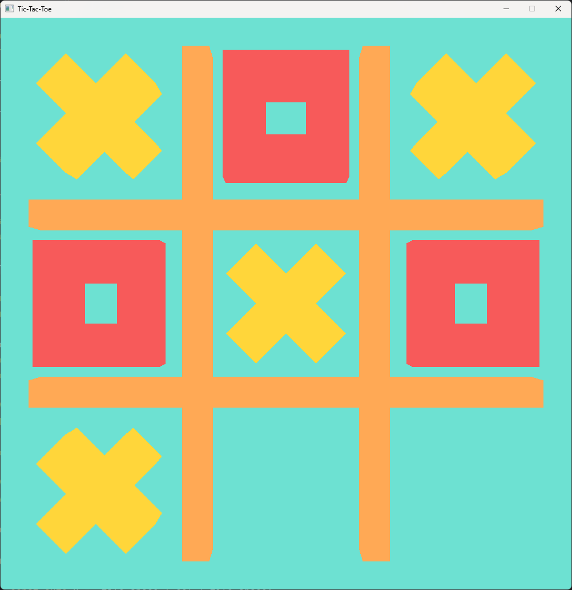

# OpenGL TicTacToe

This project is a basic implementation of 3D object rendering using OpenGL. The main goal is to learn and demonstrate fundamental OpenGL concepts such as buffers, vertices, and rendering pipelines. Everything in the project is built from scratch without relying on advanced frameworks, making it ideal for beginners who want to understand how OpenGL works under the hood.

## Features
- Simple 3D object rendering
- Manual buffer and vertex management
- Written primarily in C++ / OpenGL

## Game Preview

## Tasks & Future Improvements

- [ ] Create a File class to read simple text
- [ ] Move PhysicsDebug into a separate file
- [ ] Create a Board class
- [ ] Create a Window class
- [ ] Create Window Events class
- [ ] Create a Shader (Stage) class
- [ ] Create a Program (Shader) class
- [ ] Create an Importer class for 3d Models on top of assimp
- [ ] Create a Vertex Array class
- [ ] Create a Buffer class
- [ ] Optimize the ray creation for the physics raycast
- [ ] Create a Physics class?
- [ ] Create a GL Pipeline class
- [ ] Make use of Uniform buffers
- [ ] Create a Commands class
